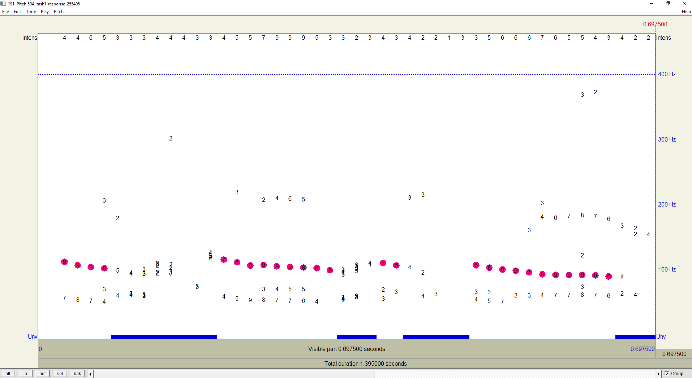
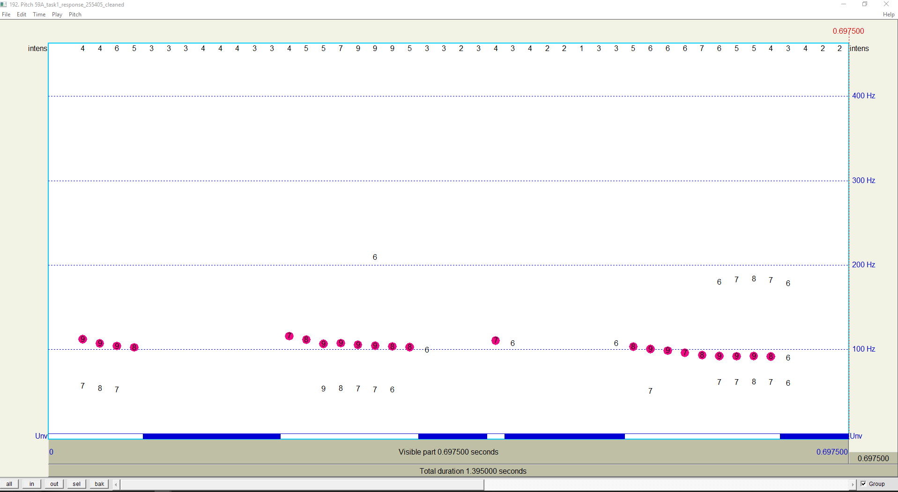

# Clean up Praat .Pitch files

I built a tool that allows you to automatically clean up .Pitch files created in Praat. Specifically, it allows you to do two things:
1. Only select pitch candidates above a certain threshold (e.g., confidence values of 7 or higher). These are the pink dots in Praat.
2. Only show pitch candidates above a certain threshold (e.g., confidence values of 5 or higher). This applies to all visible pitch candidates in Praat, not just the pink ones.

When running the script, you will be asked to choose the folder that contains your .Pitch files, to select a selection threshold (see 1 above) and to select a visibility threshold (see 2 above). The script will then run through the .Pitch files in your folder and save the cleaned versions with the suffix _cleaned.Pitch. Currently, if you run the script twice (e.g., with different settings), the previous _cleaned.Pitch versions will be overwritten.

This is an example of an original .Pitch object on the left and a cleaned .Pitch object on the right.
 
*Here I only selected pitch candidates with confidence above 7 and only show pitch candidates with confidence above 6.*

This directory currently contains the following files:
1. 1_[WigSpac_1]_CreatePitchFiles.praat: A Praat script to create .Pitch files based on .wav files and corresponding .TextGrid files (adapted from Simon Wehrle, https://osf.io/5e7fd/overview)
2. 2_DeleteLowConfidenceCandidates.py: A Python script to clean up the .Pitch files (I run it in Visual Studio Code). 
3. 2_DeleteLowConfidenceCandidates.exe: An executable (.exe) version of the Python script, that can be run more easily if you're unfamiliar with Python.
4. 3_[WigSpac_1]_Mausmooth_ManualPitchCorrection.praat: A script to manually correct the cleaned .Pitch files (adpated from Simon Wehrle, https://osf.io/5e7fd/overview)

I'm curious what people think about this tool so let me know if you have any questions or feedback.

Marlijn ter Bekke (marlijn.terbekke@donders.ru.nl)
